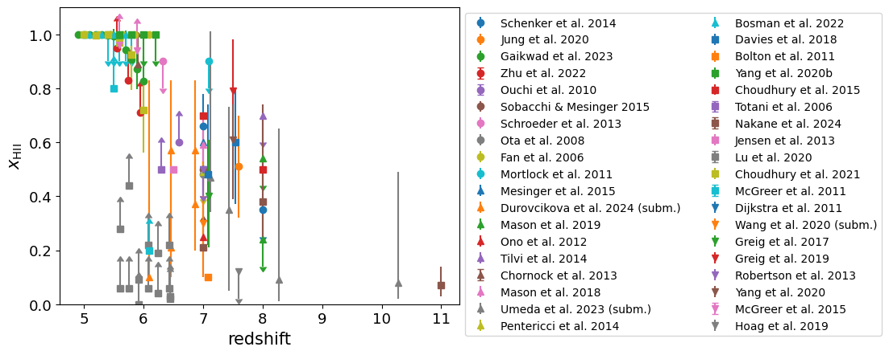

.. _HII_fraction:

Hydrogen ionized fraction
=========================

**Field names**: 
"HII_fraction", "ionized_fraction", "x_HII", "f_HII", "x_ion", "f_ion", "ion_frac"

**Units**: 

**Remarks**: 
volume-averaged

**Required fields**: 
"redshift"

    
Data
^^^^

**Data sources**

|Bolton et al. 2011|

.. |Bolton et al. 2011| raw:: html

   <a href="https://academic.oup.com/mnrasl/article/416/1/L70/1069209" target="_blank">Bolton et al. 2011</a>

|Bosman et al. 2022|

.. |Bosman et al. 2022| raw:: html

   <a href="https://ui.adsabs.harvard.edu/abs/2022MNRAS.514...55B/abstract" target="_blank">Bosman et al. 2022</a>

|Chornock et al. 2013|

.. |Chornock et al. 2013| raw:: html

   <a href="https://iopscience.iop.org/article/10.1088/0004-637X/774/1/26" target="_blank">Chornock et al. 2013</a>

|Choudhury et al. 2015|

.. |Choudhury et al. 2015| raw:: html

   <a href="https://academic.oup.com/mnras/article/452/1/261/1748658" target="_blank">Choudhury et al. 2015</a>

|Choudhury et al. 2021|

.. |Choudhury et al. 2021| raw:: html

   <a href="https://ui.adsabs.harvard.edu/abs/2021MNRAS.501.5782C/abstract" target="_blank">Choudhury et al. 2021</a>

|Davies et al. 2018|

.. |Davies et al. 2018| raw:: html

   <a href="https://iopscience.iop.org/article/10.3847/1538-4357/aad6dc" target="_blank">Davies et al. 2018</a>

|Dijkstra et al. 2011|

.. |Dijkstra et al. 2011| raw:: html

   <a href="https://academic.oup.com/mnras/article/414/3/2139/1037521" target="_blank">Dijkstra et al. 2011</a>

|Durovcikova et al. 2024 (subm.)|

.. |Durovcikova et al. 2024 (subm.)| raw:: html

   <a href="https://ui.adsabs.harvard.edu/abs/2024arXiv240110328D/abstract" target="_blank">Durovcikova et al. 2024 (subm.)</a>

|Fan et al. 2006|

.. |Fan et al. 2006| raw:: html

   <a href="https://iopscience.iop.org/article/10.1086/504836" target="_blank">Fan et al. 2006</a>

|Gaikwad et al. 2023|

.. |Gaikwad et al. 2023| raw:: html

   <a href="https://ui.adsabs.harvard.edu/abs/2023arXiv230402038G/abstract" target="_blank">Gaikwad et al. 2023</a>

|Greig et al. 2017|

.. |Greig et al. 2017| raw:: html

   <a href="https://academic.oup.com/mnras/article/466/4/4239/2738738" target="_blank">Greig et al. 2017</a>

|Greig et al. 2019|

.. |Greig et al. 2019| raw:: html

   <a href="https://academic.oup.com/mnras/article-abstract/484/4/5094/5300127" target="_blank">Greig et al. 2019</a>

|Hoag et al. 2019|

.. |Hoag et al. 2019| raw:: html

   <a href="https://iopscience.iop.org/article/10.3847/1538-4357/ab1de7" target="_blank">Hoag et al. 2019</a>

|Jensen et al. 2013|

.. |Jensen et al. 2013| raw:: html

   <a href="https://academic.oup.com/mnras/article/428/2/1366/1004492" target="_blank">Jensen et al. 2013</a>

|Jung et al. 2020|

.. |Jung et al. 2020| raw:: html

   <a href="https://ui.adsabs.harvard.edu/abs/2020ApJ...904..144J/abstract" target="_blank">Jung et al. 2020</a>

|Lu et al. 2020|

.. |Lu et al. 2020| raw:: html

   <a href="https://iopscience.iop.org/article/10.3847/1538-4357/ab7db7/pdf" target="_blank">Lu et al. 2020</a>

|Mason et al. 2018|

.. |Mason et al. 2018| raw:: html

   <a href="https://iopscience.iop.org/article/10.3847/1538-4357/aab0a7" target="_blank">Mason et al. 2018</a>

|Mason et al. 2019|

.. |Mason et al. 2019| raw:: html

   <a href="https://academic.oup.com/mnras/article/485/3/3947/5369632" target="_blank">Mason et al. 2019</a>

|McGreer et al. 2011|

.. |McGreer et al. 2011| raw:: html

   <a href="https://academic.oup.com/mnras/article/415/4/3237/1747511" target="_blank">McGreer et al. 2011</a>

|McGreer et al. 2015|

.. |McGreer et al. 2015| raw:: html

   <a href="https://academic.oup.com/mnras/article/447/1/499/990109" target="_blank">McGreer et al. 2015</a>

|Mesinger et al. 2015|

.. |Mesinger et al. 2015| raw:: html

   <a href="https://academic.oup.com/mnras/article/446/1/566/1322451" target="_blank">Mesinger et al. 2015</a>

|Mortlock et al. 2011|

.. |Mortlock et al. 2011| raw:: html

   <a href="https://www.nature.com/articles/nature10159" target="_blank">Mortlock et al. 2011</a>

|Nakane et al. 2024|

.. |Nakane et al. 2024| raw:: html

   <a href="https://ui.adsabs.harvard.edu/abs/2023arXiv231206804N/abstract" target="_blank">Nakane et al. 2024</a>

|Ono et al. 2012|

.. |Ono et al. 2012| raw:: html

   <a href="https://iopscience.iop.org/article/10.1088/0004-637X/744/2/83" target="_blank">Ono et al. 2012</a>

|Ota et al. 2008|

.. |Ota et al. 2008| raw:: html

   <a href="https://iopscience.iop.org/article/10.1086/529006" target="_blank">Ota et al. 2008</a>

|Ouchi et al. 2010|

.. |Ouchi et al. 2010| raw:: html

   <a href="https://iopscience.iop.org/article/10.1088/0004-637X/723/1/869" target="_blank">Ouchi et al. 2010</a>

|Pentericci et al. 2014|

.. |Pentericci et al. 2014| raw:: html

   <a href="https://iopscience.iop.org/article/10.1088/0004-637X/793/2/113" target="_blank">Pentericci et al. 2014</a>

|Robertson et al. 2013|

.. |Robertson et al. 2013| raw:: html

   <a href="https://iopscience.iop.org/article/10.1088/0004-637X/768/1/71" target="_blank">Robertson et al. 2013</a>

|Schenker et al. 2014|

.. |Schenker et al. 2014| raw:: html

   <a href="https://iopscience.iop.org/article/10.1088/0004-637X/795/1/20" target="_blank">Schenker et al. 2014</a>

|Schroeder et al. 2013|

.. |Schroeder et al. 2013| raw:: html

   <a href="https://academic.oup.com/mnras/article/428/4/3058/994930" target="_blank">Schroeder et al. 2013</a>

|Sobacchi & Mesinger 2015|

.. |Sobacchi & Mesinger 2015| raw:: html

   <a href="https://academic.oup.com/mnras/article/453/2/1843/1149347" target="_blank">Sobacchi & Mesinger 2015</a>

|Tilvi et al. 2014|

.. |Tilvi et al. 2014| raw:: html

   <a href="https://iopscience.iop.org/article/10.1088/0004-637X/794/1/5" target="_blank">Tilvi et al. 2014</a>

|Totani et al. 2006|

.. |Totani et al. 2006| raw:: html

   <a href="https://academic.oup.com/pasj/article/58/3/485/1503875" target="_blank">Totani et al. 2006</a>

|Umeda et al. 2023 (subm.)|

.. |Umeda et al. 2023 (subm.)| raw:: html

   <a href="https://ui.adsabs.harvard.edu/abs/2023arXiv230600487U/abstract" target="_blank">Umeda et al. 2023 (subm.)</a>

|Wang et al. 2020 (subm.)|

.. |Wang et al. 2020 (subm.)| raw:: html

   <a href="https://arxiv.org/pdf/2004.10877.pdf" target="_blank">Wang et al. 2020 (subm.)</a>

|Yang et al. 2020|

.. |Yang et al. 2020| raw:: html

   <a href="https://arxiv.org/pdf/2006.13452.pdf" target="_blank">Yang et al. 2020</a>

|Yang et al. 2020b|

.. |Yang et al. 2020b| raw:: html

   <a href="https://ui.adsabs.harvard.edu/abs/2020ApJ...904...26Y/abstract" target="_blank">Yang et al. 2020b</a>

|Zhu et al. 2022|

.. |Zhu et al. 2022| raw:: html

   <a href="https://ui.adsabs.harvard.edu/abs/2022ApJ...932...76Z/abstract" target="_blank">Zhu et al. 2022</a>

