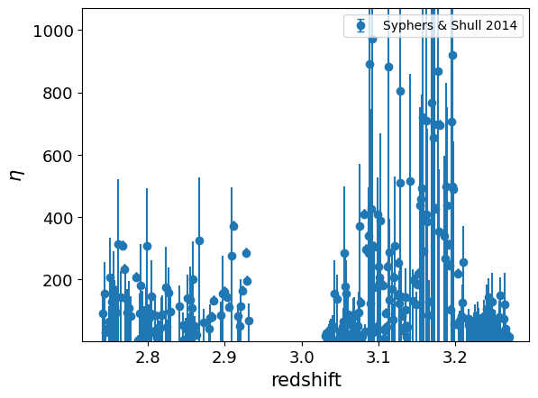

.. _HeII_to_HI_column_density_ratio:

HeII-to-HI column density ratio
===============================

**Field names**: 
"HeII_to_HI_column_density_ratio", "eta"

**Units**: 

**Remarks**: 

**Required fields**: 
"redshift"

    
Data
^^^^

**Data sources**

|Syphers & Shull 2014|

.. |Syphers & Shull 2014| raw:: html

   <a href="https://iopscience.iop.org/article/10.1088/0004-637X/784/1/42" target="_blank">Syphers & Shull 2014</a>

