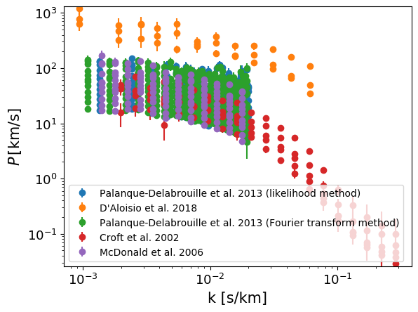

.. _Lya_flux_ps:

Ly-alpha flux power spectrum
============================

Data sources
^^^^^^^^^^^^

|Palanque-Delabrouille et al. 2013 (likelihood method)|

.. |Palanque-Delabrouille et al. 2013 (likelihood method)| raw:: html

   <a href="https://www.aanda.org/articles/aa/abs/2013/11/aa22130-13/aa22130-13.html" target="_blank">Palanque-Delabrouille et al. 2013 (likelihood method)</a>

|D'Aloisio et al. 2018|

.. |D'Aloisio et al. 2018| raw:: html

   <a href="https://academic.oup.com/mnras/article-abstract/473/1/560/4159371" target="_blank">D'Aloisio et al. 2018</a>

|Palanque-Delabrouille et al. 2013 (Fourier transform method)|

.. |Palanque-Delabrouille et al. 2013 (Fourier transform method)| raw:: html

   <a href="https://www.aanda.org/articles/aa/abs/2013/11/aa22130-13/aa22130-13.html" target="_blank">Palanque-Delabrouille et al. 2013 (Fourier transform method)</a>

|Croft et al. 2002|

.. |Croft et al. 2002| raw:: html

   <a href="https://iopscience.iop.org/article/10.1086/344099" target="_blank">Croft et al. 2002</a>

|McDonald et al. 2006|

.. |McDonald et al. 2006| raw:: html

   <a href="https://iopscience.iop.org/article/10.1086/444361" target="_blank">McDonald et al. 2006</a>

