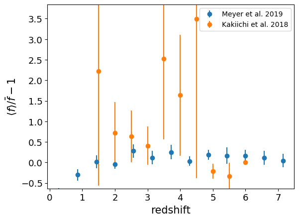

.. _Lya_spike_galaxy_correlation:

Ly-alpha spike - galaxy correlation
===================================

**Field names**: 
"Lya_spike_galaxy_correlation"

**Units**: 

**Remarks**: 

**Required fields**: 
"redshift"

    
Data
^^^^

**Data sources**

|Kakiichi et al. 2018|

.. |Kakiichi et al. 2018| raw:: html

   <a href="https://academic.oup.com/mnras/article/479/1/43/4999925" target="_blank">Kakiichi et al. 2018</a>

|Kashino et al. 2023|

.. |Kashino et al. 2023| raw:: html

   <a href="https://ui.adsabs.harvard.edu/abs/2023ApJ...950...66K/abstract" target="_blank">Kashino et al. 2023</a>

|Meyer et al. 2019|

.. |Meyer et al. 2019| raw:: html

   <a href="https://academic.oup.com/mnras/article/483/1/19/5159477" target="_blank">Meyer et al. 2019</a>

|Meyer et al. 2020|

.. |Meyer et al. 2020| raw:: html

   <a href="https://ui.adsabs.harvard.edu/abs/2020MNRAS.494.1560M/abstract" target="_blank">Meyer et al. 2020</a>

