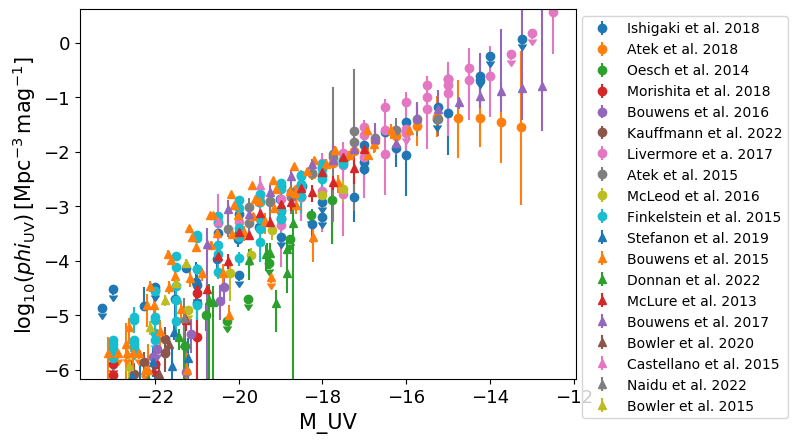

.. _UV_luminosity_function:

Galaxy UV luminosity function
=============================

**Field names**: 
"UV_luminosity_function", "UVLF"

**Units**: 
Mpc^-3 mag^-1

**Remarks**: 

**Required fields**: 
"redshift", "M_UV"

    
Data
^^^^

**Data sources**

|Atek et al. 2015|

.. |Atek et al. 2015| raw:: html

   <a href="https://ui.adsabs.harvard.edu/abs/2015ApJ...800...18A/abstract" target="_blank">Atek et al. 2015</a>

|Atek et al. 2018|

.. |Atek et al. 2018| raw:: html

   <a href="https://academic.oup.com/mnras/article/479/4/5184/5050078" target="_blank">Atek et al. 2018</a>

|Bouwens et al. 2015|

.. |Bouwens et al. 2015| raw:: html

   <a href="https://iopscience.iop.org/article/10.1088/0004-637X/803/1/34" target="_blank">Bouwens et al. 2015</a>

|Bouwens et al. 2016|

.. |Bouwens et al. 2016| raw:: html

   <a href="https://iopscience.iop.org/article/10.3847/0004-637X/830/2/67" target="_blank">Bouwens et al. 2016</a>

|Bouwens et al. 2017|

.. |Bouwens et al. 2017| raw:: html

   <a href="https://iopscience.iop.org/article/10.3847/1538-4357/aa70a4" target="_blank">Bouwens et al. 2017</a>

|Bouwens et al. 2023|

.. |Bouwens et al. 2023| raw:: html

   <a href="https://ui.adsabs.harvard.edu/abs/2023MNRAS.523.1036B/abstract" target="_blank">Bouwens et al. 2023</a>

|Bowler et al. 2015|

.. |Bowler et al. 2015| raw:: html

   <a href="https://academic.oup.com/mnras/article/452/2/1817/1068199" target="_blank">Bowler et al. 2015</a>

|Bowler et al. 2020|

.. |Bowler et al. 2020| raw:: html

   <a href="https://academic.oup.com/mnras/article/493/2/2059/5721544" target="_blank">Bowler et al. 2020</a>

|Castellano et al. 2015|

.. |Castellano et al. 2015| raw:: html

   <a href="https://iopscience.iop.org/article/10.3847/2041-8205/818/1/L3" target="_blank">Castellano et al. 2015</a>

|Donnan et al. 2022|

.. |Donnan et al. 2022| raw:: html

   <a href="https://arxiv.org/pdf/2207.12356.pdf" target="_blank">Donnan et al. 2022</a>

|Finkelstein et al. 2015|

.. |Finkelstein et al. 2015| raw:: html

   <a href="https://iopscience.iop.org/article/10.1088/0004-637X/810/1/71" target="_blank">Finkelstein et al. 2015</a>

|Finkelstein et al. 2022|

.. |Finkelstein et al. 2022| raw:: html

   <a href="https://arxiv.org/pdf/2207.12474.pdf" target="_blank">Finkelstein et al. 2022</a>

|Harikane et al. 2022|

.. |Harikane et al. 2022| raw:: html

   <a href="https://arxiv.org/pdf/2208.01612.pdf" target="_blank">Harikane et al. 2022</a>

|Ishigaki et al. 2018|

.. |Ishigaki et al. 2018| raw:: html

   <a href="https://iopscience.iop.org/article/10.3847/1538-4357/aaa544" target="_blank">Ishigaki et al. 2018</a>

|Kauffmann et al. 2022|

.. |Kauffmann et al. 2022| raw:: html

   <a href="https://arxiv.org/pdf/2207.11740.pdf" target="_blank">Kauffmann et al. 2022</a>

|Livermore et a. 2017|

.. |Livermore et a. 2017| raw:: html

   <a href="https://iopscience.iop.org/article/10.3847/1538-4357/835/2/113" target="_blank">Livermore et a. 2017</a>

|McLeod et al. 2016|

.. |McLeod et al. 2016| raw:: html

   <a href="https://academic.oup.com/mnras/article/459/4/3812/2624050" target="_blank">McLeod et al. 2016</a>

|McLure et al. 2013|

.. |McLure et al. 2013| raw:: html

   <a href="https://academic.oup.com/mnras/article/432/4/2696/2907730" target="_blank">McLure et al. 2013</a>

|Morishita et al. 2018|

.. |Morishita et al. 2018| raw:: html

   <a href="https://iopscience.iop.org/article/10.3847/1538-4357/aae68c" target="_blank">Morishita et al. 2018</a>

|Naidu et al. 2022|

.. |Naidu et al. 2022| raw:: html

   <a href="https://arxiv.org/pdf/2207.09434.pdf" target="_blank">Naidu et al. 2022</a>

|Oesch et al. 2014|

.. |Oesch et al. 2014| raw:: html

   <a href="https://iopscience.iop.org/article/10.1088/0004-637X/786/2/108" target="_blank">Oesch et al. 2014</a>

|Rojas-Ruiz et al. 2020|

.. |Rojas-Ruiz et al. 2020| raw:: html

   <a href="https://iopscience.iop.org/article/10.3847/1538-4357/ab7659" target="_blank">Rojas-Ruiz et al. 2020</a>

|Stefanon et al. 2019|

.. |Stefanon et al. 2019| raw:: html

   <a href="https://iopscience.iop.org/article/10.3847/1538-4357/ab3792" target="_blank">Stefanon et al. 2019</a>

