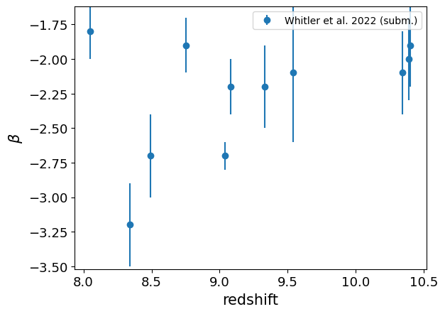

.. _UV_slope:

Slope of the galaxy UV log flux density
=======================================

Field names
^^^^^^^^^^^
"UV_slope", "beta_UV"
    
Data
^^^^

Data sources
^^^^^^^^^^^^

|Cullen et al. 2022 (subm.)|

.. |Cullen et al. 2022 (subm.)| raw:: html

   <a href="https://arxiv.org/pdf/2208.04914.pdf" target="_blank">Cullen et al. 2022 (subm.)</a>

|Tacchella et al. 2022|

.. |Tacchella et al. 2022| raw:: html

   <a href="https://ui.adsabs.harvard.edu/abs/2022ApJ...927..170T/abstract" target="_blank">Tacchella et al. 2022</a>

|Whitler et al. 2022 (subm.)|

.. |Whitler et al. 2022 (subm.)| raw:: html

   <a href="https://arxiv.org/pdf/2208.01599.pdf" target="_blank">Whitler et al. 2022 (subm.)</a>

