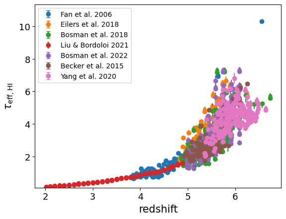

.. _effective_optical_depth_HI_Lya:

HI Ly-alpha effective optical depth
===================================

**Field names**: 
"effective_optical_depth_HI_Lya", "tau_HI", "tau_eff_HI"

**Units**: 

**Remarks**: 

**Required fields**: 
"redshift"

    
Data
^^^^

**Data sources**

|Becker et al. 2015|

.. |Becker et al. 2015| raw:: html

   <a href="https://academic.oup.com/mnras/article/447/4/3402/1748740" target="_blank">Becker et al. 2015</a>

|Fan et al. 2006|

.. |Fan et al. 2006| raw:: html

   <a href="https://iopscience.iop.org/article/10.1086/504836" target="_blank">Fan et al. 2006</a>

|Liu & Bordoloi 2020|

.. |Liu & Bordoloi 2020| raw:: html

   <a href="https://arxiv.org/abs/2006.04814" target="_blank">Liu & Bordoloi 2020</a>

