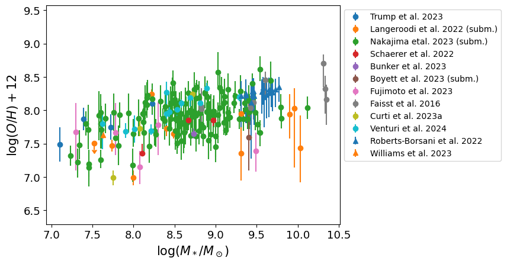

.. _mass_gas_metallicity_relation:

Gas-phase O/H metallicity as function of galaxy stellar mass
============================================================

Data sources
^^^^^^^^^^^^

|Curti et al. 2022|

.. |Curti et al. 2022| raw:: html

   <a href="https://arxiv.org/pdf/2207.12375" target="_blank">Curti et al. 2022</a>

|Faisst et al. 2016|

.. |Faisst et al. 2016| raw:: html

   <a href="https://ui.adsabs.harvard.edu/abs/2016ApJ...822...29F/abstract" target="_blank">Faisst et al. 2016</a>

|Roberts-Borsani et al. 2022|

.. |Roberts-Borsani et al. 2022| raw:: html

   <a href="https://ui.adsabs.harvard.edu/abs/2022ApJ...927..236R/abstract" target="_blank">Roberts-Borsani et al. 2022</a>

|Schaerer et al. 2022|

.. |Schaerer et al. 2022| raw:: html

   <a href="https://arxiv.org/pdf/2207.10034.pdf" target="_blank">Schaerer et al. 2022</a>

