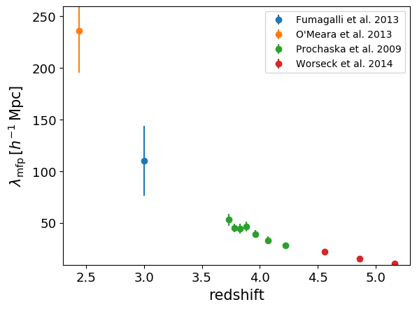

.. _mfp:

Mean free path of ionising photons
==================================

Data sources
^^^^^^^^^^^^

|Worseck et al. 2014|

.. |Worseck et al. 2014| raw:: html

   <a href="https://academic.oup.com/mnras/article/445/2/1745/1402824" target="_blank">Worseck et al. 2014</a>

|O'Meara et al. 2013|

.. |O'Meara et al. 2013| raw:: html

   <a href="https://iopscience.iop.org/article/10.1088/0004-637X/765/2/137" target="_blank">O'Meara et al. 2013</a>

|Fumagalli et al. 2013|

.. |Fumagalli et al. 2013| raw:: html

   <a href="https://iopscience.iop.org/article/10.1088/0004-637X/775/1/78" target="_blank">Fumagalli et al. 2013</a>

|Prochaska et al. 2009|

.. |Prochaska et al. 2009| raw:: html

   <a href="https://iopscience.iop.org/article/10.1088/0004-637X/705/2/L113" target="_blank">Prochaska et al. 2009</a>

