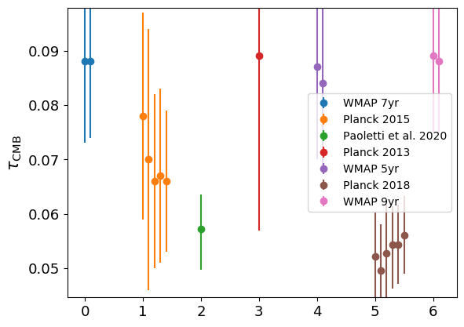

.. _tau_cmb:

CMB optical depth
=================

Data sources
^^^^^^^^^^^^

|Paoletti et al. 2020|

.. |Paoletti et al. 2020| raw:: html

   <a href="https://ui.adsabs.harvard.edu/abs/2020arXiv200512222P/abstract" target="_blank">Paoletti et al. 2020</a>

|Planck 2013|

.. |Planck 2013| raw:: html

   <a href="https://www.aanda.org/articles/aa/abs/2014/11/aa21591-13/aa21591-13.html" target="_blank">Planck 2013</a>

|Planck 2015|

.. |Planck 2015| raw:: html

   <a href="https://www.aanda.org/articles/aa/full_html/2016/10/aa25830-15/aa25830-15.html" target="_blank">Planck 2015</a>

|Planck 2018|

.. |Planck 2018| raw:: html

   <a href="https://www.aanda.org/component/article?access=doi&doi=10.1051/0004-6361/201833910" target="_blank">Planck 2018</a>

|WMAP 5yr|

.. |WMAP 5yr| raw:: html

   <a href="https://iopscience.iop.org/article/10.1088/0067-0049/180/2/330/pdf" target="_blank">WMAP 5yr</a>

|WMAP 7yr|

.. |WMAP 7yr| raw:: html

   <a href="https://iopscience.iop.org/article/10.1088/0067-0049/192/2/18/pdf" target="_blank">WMAP 7yr</a>

|WMAP 9yr|

.. |WMAP 9yr| raw:: html

   <a href="https://iopscience.iop.org/article/10.1088/0067-0049/208/2/19/pdf" target="_blank">WMAP 9yr</a>

