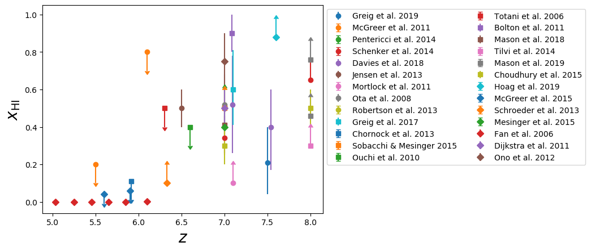

.. _Tutorial:

Using CoReCon: tutorial
=======================

0. Installation
^^^^^^^^^^^^^^^
*WARNING: CoReCon is still in the beta-testing phase.*

CoReCon can be installed as a python module, using:

.. code-block:: bash

    pip install corecon

and then loaded e.g. using:

.. code-block:: python

    import corecon as crc

If you have already installed CoReCon and wish to upgrade it to the latest version, use:

.. code-block:: bash

    pip install -U corecon

1. Data organization and retrieval
^^^^^^^^^^^^^^^^^^^^^^^^^^^^^^^^^^
CoReCon stores data in an individual DataEntry class for each data source. The available fields are described
in :ref:`DataEntryTemplate`, while the available utility functions are described below.

DataEntry classes are stored in dictionaries, sorted based on the physical quantity they describe, whose keys are
the source paper short citation. Available quantities are listed in the section :ref:`AvailableCoinstraints`, 
and can also be retrieved from python using:

.. code-block:: python

    available_fields = crc.fields()

This returns a tuple containing all available field names (as strings). These strings are used to specify the data to 
load, using (for e.g. the quasar luminosity function, shorthanded to qlf):

.. code-block:: python

   qlf = crc.get("qlf")
   
   print(qlf.field_description)
   > ...

   for k in qlf.keys():
       print(k)

   > Kulkarni et al. 2019
   > Giallongo et al. 2015
   > McGreer et al. 2013
   > Yang et al. 2016
   > Willott et al. 2010
   > Jiang et al. 2016
   > Kashikawa et al. 2015
   > Glikman et al. 2011
   > Giallongo et al. 2019
   > Ross et al. 2013

All keys are string. The class attribute field_description (which is NOT part of the dict keys) contains a string with a breif description (using matplotlib's Math Text) of
the quantity used in values, err_up, err_down, including their units (if present). 

It is also possible to retrieve all available dictionaries, using:

.. code-block:: python

   all_dicts = crc.get_all_dicts()

which returns a dictionary, whose keys are the available field. Retrieving a key produces the same result as using crc.get() with
the same key.

In case you want to add your own dataset, this can be done simply adding a properly-formatted file into one of the data/ subdirectories.
You can find more information on the format in :ref:`DataEntryTemplate`. For convenience, such template can be retrieved directly from
CoReCon using:

.. code-block:: python

   template_string = crc.get_data_entry_template()

which returns the template as a string.

Finally, each data entry is an istance of the custom DataEntry class, and its field can be retrieved simply using e.g.:

.. code-block:: python

    values = qlf['McGreer et al. 2013'].values

The available fields are described in :ref:`DataEntryTemplate`. Finally, for convenience, additional non-standard fields are listed in

.. code-block:: python

    extra_names = qlf['McGreer et al. 2013'].extra_data

2. Utility functions
^^^^^^^^^^^^^^^^^^^^
CoReCon provides also some basic utilities functions. 

Available constraints within a redshift range can be retrieved with:

.. code-block:: python

   qlf_zrange = crc.filter_by_redshift_range("qlf", 5.0, 6.0)

Similarly, the data available can be filtered to return only upper or lower limits, using:

.. code-block:: python

   qlf_ll = crc.get_lower_limits("qlf")
   qlf_ul = crc.get_upper_limits("qlf")

In the same way, the constraints can be filtered based on the value of their *extracted* keyword, using:

.. code-block:: python

   qlf_zrange = crc.filter_by_extracted("qlf", True)

In each DataEntry, upper and lower limits can be swapped (e.g. to be used in derived quantity, for instance 1-ionised_fraction) 
using:

.. code-block:: python

   qlf['Kulkarni et al. 2019'].swap_limits()

CoReCon uses numpy.nan to indicate missing data entries. In case they need to be replaced (e.g. for plotting or operation
on data), CoReCon provides the following utility:

.. code-block:: python

   qlf['Kulkarni et al. 2019'].nan_to_value('values', 0.0)

where the first argument is a string among 'values', 'err_up', 'err_down', 'all' that specify in which
DataEntry array NaN should be replaced. The second argument, i. e. the value to replace NaN with, can either be a scalar or an
array of the appropriate shape.

Finally, CoReCon provides a function that replaces all the entries in err_up and err_down corresponding
to upper or lower limits with a user defined value v, which can be specified as a fraction of the correspondent value entries.
It can be used, e. g. to easily set arrow length when plotting limits with matplotlib.pyplot's errorbar() function.
Error on limits can be set using:

.. code-block:: python

   qlf['Kulkarni et al. 2019'].set_lim_errors(0.1, frac_of_values=True)

The documentation for CoReCon public functions can be found at :ref:`Docs`.

3. Complete example
^^^^^^^^^^^^^^^^^^^

Finally, we provide here a simple head-to-tail example of usage, namely to create a plot of the ionized fraction evolution with redshift.

.. code-block:: python

   import corecon as crc
   import matplotlib.pyplot as plt
   import numpy as np

   #get ionized fraction
   ionfr = crc.get("ionized_fraction")

   #create figure, ax, and markers cycle
   fig, ax = plt.subplots(1) 
   markers = ['o', 's', 'D'] 
   
   #loop over available datasets
   for ik,k in enumerate(ionfr.keys()):
    
       #if k=="field_description": 
       #    continue 

       #find redshift dimension 
       zdim = np.where(ionfr[k].dimensions_descriptors == "redshift")[0][0] 

       #get format
       fmt = "%sC%i"%(markers[ik//10], ik%10)
       
       #transform to neutral fraction
       ionfr[k].values = 1-ionfr[k].values  #NB: it now contains the neutral fraction!
       # ...need to swap errors
       ionfr[k].swap_errors()
       # ...and limits as well
       ionfr[k].swap_limits()
       #transform NaNs (in errors) into values to set arrow length
       ionfr[k].nan_to_values(['err_up', 'err_down'], 0.1)

       #plot 
       ax.errorbar(ionfr[k].axes[:,zdim], ionfr[k].values, 
                   yerr=[ionfr[k].err_down, ionfr[k].err_up], 
                   lolims=ionfr[k].lower_lim, uplims=ionfr[k].upper_lim, 
                   fmt=fmt, label=k) 
   
   #move legend to side
   ax.legend(bbox_to_anchor=(1.0, 1.0), bbox_transform=ax.transAxes, loc='upper left') 
   
   #save figure and close
   fig.savefig( "neutral_fraction_evolution.png" , bbox_inches='tight')
   plt.close(fig)

The above script produce the following plot:

